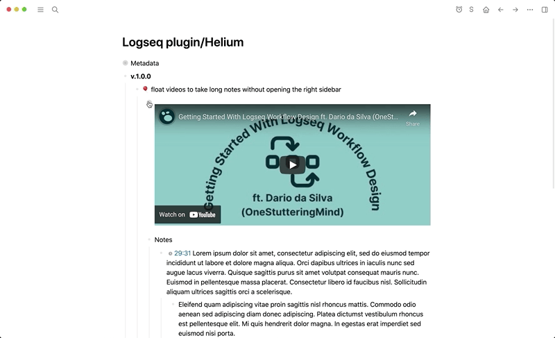
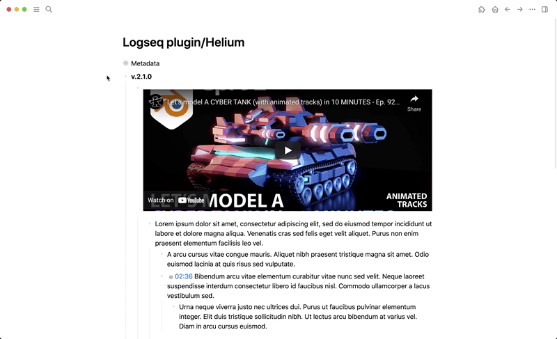

## logseq-helium-plugin
> If you find this plugin – or any of my other [Logseq plugins](https://github.com/vyleung?tab=repositories&q=logseq&type=source) – useful and would like to support me, you can [buy me a coffee](https://www.buymeacoffee.com/vyleung) 🙂

## Features
### Float videos for an improved note-taking experience in 3 ways:
- Block context menu (right-click on bullet) → `🎈 Start float`
- Slash (/) command → `🎈 Start float`
- Keyboard shortcut
    - Usage: click on the task (as if to edit it) → activate the keyboard shortcut (can be configured in the [settings](settings))

#### Note about videos
> When a video is being floated, clicking on the dimensions icon underneath the balloon icon will enable the video's height (H) and width (W) to be <u>individually</u> or <u>simultaneously</u> adjusted. 
>
> If the video is a YouTube video or a local video, you can use keyboard shortcuts to play/pause and skip forward/backward as well as adjust the video's playback speed (keyboard shortcuts, skip duration, and playback speed increment can be configured in the [settings](settings))

#### Demo
- v.1.0.x: Using the block context menu to float the video  
  
- v.1.1.x: Using the keyboard shortcut to float the video  
  
- v.2.0.x: Using keyboard shortcuts to play/pause the video and skip forward/backward in the video  

- v.2.1.x: Adjust the video's playback speed  

## Settings
- Each time you make changes to the plugin settings, please refresh Logseq to ensure that all settings are updated  
  

## Installation
### Preparation
1. Click the 3 dots in the righthand corner → `Settings` → `Advanced` → Enable `Developer mode` and `Plug-in system`
2. Click the 3 dots in the righthand corner → `Plugins` – OR – Use keyboard shortcut `Esc t p`

### Load plugin via the marketplace (recommended)
1. Click the 3 dots in the righthand corner → `Plugins` – OR – Use keyboard shortcut `Esc t p`
2. Go to the `Marketplace` tab and search for `Helium` → Click `Install`

### Load plugin manually
1. Download the [latest release](https://github.com/vyleung/logseq-helium-plugin/releases) of the plugin (e.g logseq-helium-plugin-v.1.0.0.zip) from Github
2. Unzip the file
3. Navigate to plugins (Click the 3 dots → `Plugins` – OR – Use keyboard shortcut `Esc t p`) → `Load unpacked plugin` → Select the folder of the unzipped file

## License
MIT

## Credits
- Plugin marketplace icon: Designed by [OpenMoji](https://openmoji.org/) – the open-source emoji and icon project. License: [CC BY-SA 4.0](https://creativecommons.org/licenses/by-sa/4.0/#)
- Plugin control icons: [Tabler Icons](https://tablericons.com/)
- Plugin name and concept inspired by the [Helium Mac App](https://github.com/JadenGeller/Helium)