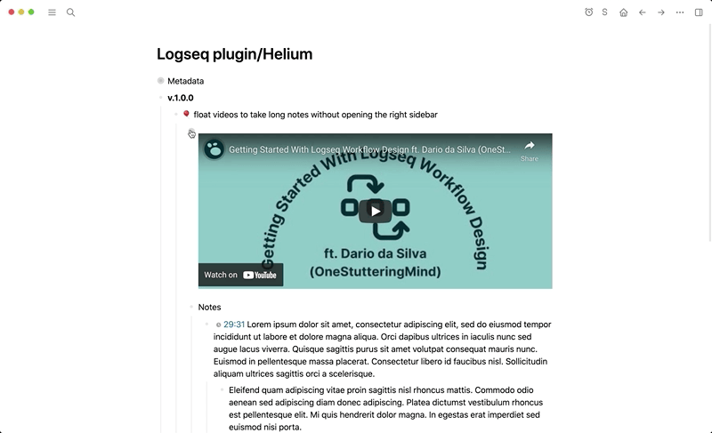
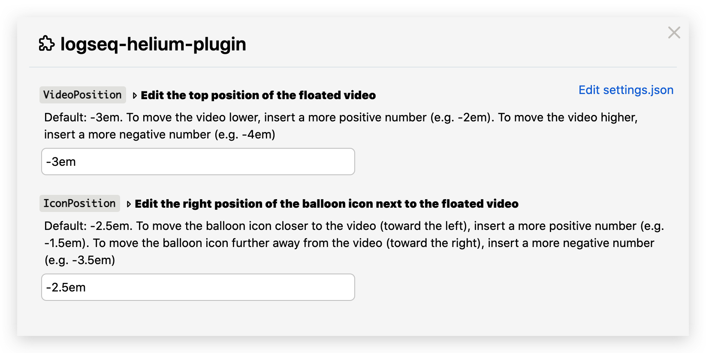

## logseq-helium-plugin

## Features
### Float videos for better note-taking in 2 ways:
- Block context menu (right-click on bullet)
- Slash (/) command 
#### Demo

- ❌ Without the plugin: Watch the video in the left main area and take notes in the right sidebar
- ✅ With the plugin: Watch the video and take notes in the main area!
    - The position of the video and the balloon icon can be configured in the [settings](#settings)

## Settings
- Each time you make changes to the plugin settings, please refresh Logseq to ensure that all settings are updated

## Installation
### Preparation
1. Click the 3 dots in the righthand corner → `Settings` → `Advanced` → Enable `Developer mode` and `Plug-in system`
2. Click the 3 dots in the righthand corner → `Plugins` – OR – Use keyboard shortcut `Esc t p`

### Load plugin via the marketplace (recommended)
1. Click the 3 dots in the righthand corner → `Plugins` – OR – Use keyboard shortcut `Esc t p`
2. Go to the `Marketplace` tab and search for `Helium` → Click `Install`

### Load plugin manually
1. Download the [latest release](https://github.com/vyleung/logseq-helium-plugin/releases) of the plugin (e.g logseq-helium-plugin-v.1.0.0.zip) from Github
2. Unzip the file
3. Navigate to plugins (Click the 3 dots → `Plugins` – OR – Use keyboard shortcut `Esc t p`) → `Load unpacked plugin` → Select the folder of the unzipped file

## License
MIT

## Credits
- Plugin Marketplace Icon: Designed by [OpenMoji](https://openmoji.org/) – the open-source emoji and icon project. License: [CC BY-SA 4.0](https://creativecommons.org/licenses/by-sa/4.0/#)
- Plugin name and concept inspired by the [Helium Mac App](https://github.com/JadenGeller/Helium)

## Support
If you find this plugin useful, consider buying me a coffee 🙂  
